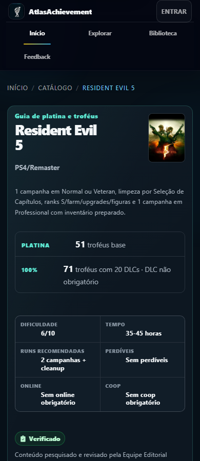
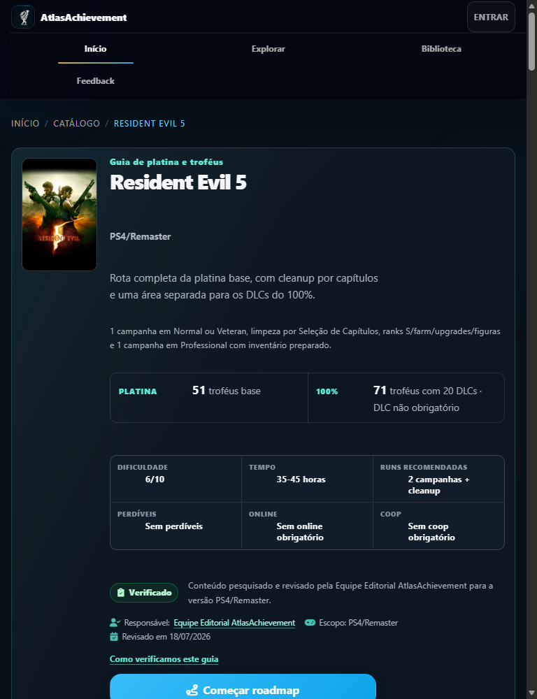
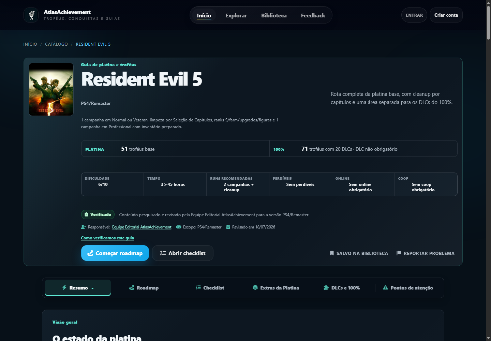

# Resident Evil 5 — Fase 7 — Certificação final

Data da auditoria: 21/07/2026  
Página-alvo: `https://atlasachievement.com.br/jogo/resident-evil-5`  
Ambiente certificado: build local, API, SSR e DOM hidratado na revisão presente no workspace  
Veredito: **APROVADO**  
Score geral: **96/100**  
Recomendação de deploy: **APTO PARA DEPLOY, mediante o fluxo normal de revisão/publicação do projeto. Nenhum deploy foi executado nesta fase.**

## 1. Resumo executivo

O guia atende à Definition of Done da Fase 7: zero P0 e zero P1 abertos, 71/71 troféus únicos, paridade estrutural entre as camadas, 12/12 jornadas concluídas, seis abas funcionais, experiência mobile utilizável, nenhuma falha crítica/séria conhecida no escopo WCAG 2.2 AA auditado, desempenho sem regressão relevante, JSON-LD/canonical/sitemap corretos, resiliência aprovada, três outros guias sem regressão observada e build/testes aprovados.

Foram corrigidos três achados P1 localizados: divergência do roadmap entre fonte e snapshot/banco; compressão/sobreposição do hero em 768 px; e cinco destinos editoriais que apontavam para versões/URLs inadequadas. Não houve redesign adicional, nova funcionalidade, aumento editorial para SEO, alteração intencional em outro jogo, commit ou deploy.

Conclusão competitiva permitida e sustentada pelos dados: **“Dentro da matriz auditada, o Atlas iguala ou supera os concorrentes acessíveis em cobertura operacional e autossuficiência.”** A conclusão é restrita aos sistemas e fontes efetivamente mensuráveis; não é uma afirmação absoluta sobre toda a internet.

Limitações transparentes:

- não existe `RELATORIO_RE5_FASE0.md` no workspace; as Fases 1–6 foram lidas integralmente e a ausência da Fase 0 foi registrada, sem inventar seu conteúdo;
- a automação do navegador integrado não iniciou por erro de política do sandbox (`missing field sandboxPolicy`); os testes foram realizados com Edge headless via CDP, sem contornar antibot;
- PlayStationTrophies e parte do GameFAQs/TrueAchievements retornaram 403 ao cliente automatizado; esses casos ficaram “não mensuráveis” quando a página não pôde ser inspecionada e snippets não foram usados como prova conclusiva;
- não há dados de campo de INP; este relatório não afirma aprovação de INP;
- a certificação é local e não substitui a verificação pós-deploy.

## 2. Condição de entrada e preservação

A Fase 6 foi confirmada no código, build local, API, SSR e DOM, e não apenas por seu relatório. Contagens finais:

| Conteúdo | Resultado |
|---|---:|
| Troféus base | 51 |
| Troféus de DLC | 20 |
| Troféus únicos | 71 |
| FAQs | 36 |
| Pontos de atenção | 12 |
| Chefes | 22 |
| BSAA Emblems | 30 |
| Tesouros | 50 |
| Score Stars | 18 |
| Agitator Majini | 3 |
| Capítulos | 16 |
| Etapas do roadmap | 7 |
| Figuras instrucionais | 5 |
| Abas | 6 |

Também foram preservados autoria, fontes/metodologia, histórico editorial, canonical, schemas, renderização sem JavaScript, checklist persistente, acessibilidade, fragments públicos e anchors. Há 51 códigos de troféu base únicos no banco e zero ID HTML duplicado.

Evidência principal: [`data-layer-audit.json`](artifacts/re5-phase7/data-layer-audit.json), [`browser-qa.json`](artifacts/re5-phase7/browser-qa.json) e os testes `test:guide`.

## 3. Benchmark competitivo

Escala: 0 ausente; 1 menção; 2 requisito; 3 executável; 4 executável com risco/recuperação; 5 referência completa/autossuficiente. `NM` significa não mensurável. A tabela abaixo apresenta a média das dez dimensões por sistema. A matriz integral contém **27 sistemas × 8 entidades × 10 dimensões = 2.160 células**, e cada célula possui nota e justificativa curta ou motivo explícito de `null`.

Arquivos integrais: [`benchmark-matrix.json`](artifacts/re5-phase7/benchmark-matrix.json) e [`benchmark-matrix.csv`](artifacts/re5-phase7/benchmark-matrix.csv).

| Sistema | Atlas | PST | PSNP | PowerPyx | GameFAQs | TA | Comunidade | Capcom |
|---|---:|---:|---:|---:|---:|---:|---:|---:|
| Roadmap | 4,70 | NM | NM | NM | 3,30 | 2,00 | NM | 0,00 |
| Capítulos | 4,80 | NM | NM | NM | 2,90 | NM | NM | 0,00 |
| Troféus base | 4,40 | NM | NM | NM | 2,90 | 2,00 | NM | 0,00 |
| BSAA Emblems | 4,50 | NM | NM | NM | 3,30 | NM | 3,10 | 0,00 |
| Tesouros | 4,90 | NM | NM | NM | 3,30 | NM | NM | 0,00 |
| Armas e Stockpile | 4,40 | NM | NM | NM | 2,90 | NM | NM | 0,00 |
| Upgrades | 4,40 | NM | NM | NM | 2,40 | NM | NM | 0,00 |
| Trajes | 4,80 | NM | NM | NM | 2,40 | NM | NM | 0,00 |
| Figures | 4,40 | NM | NM | NM | 2,40 | NM | NM | 0,00 |
| Ranks S | 4,40 | NM | NM | NM | 2,40 | NM | NM | 0,00 |
| Infinite Ammo | 4,80 | NM | NM | NM | 2,40 | NM | NM | 0,00 |
| Infinite Rocket Launcher | 4,80 | NM | NM | NM | 1,70 | NM | NM | 0,00 |
| Professional | 4,90 | NM | NM | NM | 2,40 | NM | NM | 0,00 |
| IA da Sheva | 4,80 | NM | NM | NM | 1,70 | NM | NM | 0,00 |
| Farms | 4,80 | NM | NM | NM | 1,70 | NM | NM | 0,00 |
| Chefes | 4,50 | NM | NM | NM | 2,40 | NM | NM | 0,00 |
| Troféus situacionais | 4,40 | NM | NM | NM | 1,70 | NM | NM | 0,00 |
| Versus | 3,80 | NM | NM | NM | 1,00 | NM | NM | 0,00 |
| Lost in Nightmares | 4,80 | NM | NM | NM | 1,70 | NM | NM | 0,00 |
| Score Stars | 4,90 | NM | NM | NM | 3,30 | NM | 3,30 | 0,00 |
| Desperate Escape | 4,80 | NM | NM | NM | 1,00 | NM | NM | 0,00 |
| Agitators | 4,90 | NM | NM | NM | 2,40 | NM | NM | 0,00 |
| 150 kills | 4,40 | NM | NM | NM | 1,00 | NM | NM | 0,00 |
| Fontes | 4,70 | NM | NM | NM | 1,00 | NM | NM | 0,00 |
| Diferenças de versão | 4,00 | NM | NM | NM | 1,00 | NM | NM | 3,20 |
| Recuperação | 4,30 | NM | NM | NM | 1,70 | NM | NM | 0,00 |
| Apoio visual | 3,90 | NM | NM | NM | 1,00 | NM | NM | 0,00 |

Agregados apenas sobre células pontuadas: Atlas 4,56/5 (270 células); GameFAQs 2,12 (270); TrueAchievements 2,00 (20); comunidade 3,20 (20); manual Capcom 0,12 (270). O valor do manual não deve ser lido como “qualidade baixa”: ele é fonte oficial de versão/controles, não um guia de troféus. PST, PSNProfiles e PowerPyx não receberam média porque não houve página diretamente inspecionável suficiente.

As 17 intenções exigidas foram mapeadas para títulos/anchors existentes, sem keyword stuffing e sem adição de texto nesta fase. O mapa completo consulta → resposta → anchor está no campo `intents` da matriz.

### Fontes concorrentes acessíveis e bloqueadas

| Fonte | Estado para benchmark | Tratamento |
|---|---|---|
| Atlas local | Inspecionável | API, SSR, DOM, banco, snapshot e sete viewports |
| PlayStationTrophies | NM; 403 automatizado | Nenhuma nota; sem bypass e sem snippets conclusivos |
| PSNProfiles | NM | Nenhum guia público específico localizado; URL não presumida |
| PowerPyx | NM | Nenhum guia público específico localizado; URL não presumida |
| GameFAQs | Inspecionável por páginas públicas/indexadas; auditor HTTP direto 403 | FAQs selecionadas avaliadas; escopo e versão identificados |
| TrueAchievements | Parcial | Overview avaliado; subpáginas 403 ficaram sem nota |
| Comunidade | Parcial | Apenas Score Stars e BSAA inspecionados; demais sistemas NM |
| Manual Capcom | Inspecionável, HTTP 200 | Usado como fonte oficial PS4, não como guia de troféus |

## 4. Testes das 12 jornadas e localização

Todos começaram por uma entrada orgânica simulada na URL canônica com query de auditoria. Os tempos abaixo são **tempo de localização da automação após a página estar pronta**, não tempo humano de leitura e não excluem a necessidade real de ler. Para as metas de 30/10 segundos, a inspeção manual confirmou que os dados críticos estão no primeiro viewport; a ressalva online do Versus fica a um clique direto. Nenhuma jornada usou busca ou navegação por tentativa e erro.

| # | Jornada | Ponto inicial | Cliques | Tempo de localização | Busca | Anchor/alvo final | Bloqueio |
|---:|---|---|---:|---:|---|---|---|
| 1 | Novo jogador | URL canônica | 0 | 20 ms | Não | `.atlas-re5-hero` | Nenhum |
| 2 | Platina versus 100% | URL canônica | 1 | 111 ms | Não | `#re5-versus-dlc` | Nenhum |
| 3 | Retomar progresso | URL canônica | 1 | 104 ms | Não | `#guideChecklistPanel` | Nenhum |
| 4 | BSAA Emblem #29 | URL canônica | 1 | 105 ms | Não | `#re5-bsaa-emblem-29` | Nenhum |
| 5 | Heart of Africa | URL canônica | 1 | 104 ms | Não | `#re5-treasure-50-heart-of-africa` | Nenhum |
| 6 | All Dressed Up | URL canônica | 1 | 105 ms | Não | `#re5-bonus-features-all-dressed-up` | Nenhum |
| 7 | Infinite Ammo | URL canônica | 1 | 106 ms | Não | `#re5-bonus-features-infinite-ammo` | Nenhum |
| 8 | Professional | URL canônica | 1 | 128 ms | Não | `#guideProfessionalAiPanel` | Nenhum |
| 9 | Score Stars | URL canônica | 1 | 120 ms | Não | `#re5-lost-in-nightmares-score-stars` | Nenhum |
| 10 | Agitators | URL canônica | 1 | 110 ms | Não | `#re5-desperate-escape-agitator-majini` | Nenhum |
| 11 | Versus | URL canônica | 1 | 115 ms | Não | `#re5-versus-dlc` | Nenhum |
| 12 | Mobile 360/390 | URL canônica | 0 | 2 ms | Não | `.atlas-re5-hero` | Nenhum |

Cobertura funcional observada:

- novo jogador: dificuldade, tempo, dificuldade inicial, runs, perdíveis, online e início aparecem no hero/resumo, sem clique;
- platina/100%: 51 base, 71 totais e DLCs fora da platina aparecem no resumo; o detalhe “Versus online” tem CTA específico;
- retomada: troféu e roadmap persistiram após reload; checklist abre em um clique e localStorage bloqueado não remove o conteúdo;
- BSAA #29 e Heart of Africa: capítulo, ponto, método/gatilho, janela, risco, visual e recuperação presentes;
- All Dressed Up: quatro trajes, campanha, 25/30 emblemas, custo zero e gatilho do quarto desbloqueio;
- Infinite Ammo: fluxo por arma separado do Infinite Rocket Launcher, incluindo dinheiro, upgrades, Exchange Points, Special Settings e soma dos melhores tempos abaixo de cinco horas;
- Professional: desbloqueio, preparação, loadout, IA/coop, capítulos críticos, Chapter 2-3 e recuperação;
- Score Stars: rota 1–18 autossuficiente, incluindo #17, #18, crests, shards e dificuldade;
- Agitators: três métodos, com o terceiro corretamente tratado como spawn variável/prático, nunca como garantia após três ou quatro kills;
- Versus: jogadores/sessões, 15 vitórias nos quatro modos, combos, pontuação, personagens, 50 eliminações físicas no PS4 e ressalva temporária de disponibilidade;
- mobile: jornadas e navegação aprovadas em 360 e 390 px, sem zoom, overflow horizontal, foco coberto ou abas/filtros inacessíveis.

Evidência: [`journeys-resilience-a11y.json`](artifacts/re5-phase7/journeys-resilience-a11y.json).

## 5. Auditoria factual final

| Ponto sensível | Resultado auditado | Classificação editorial |
|---|---|---|
| All Dressed Up | Safari/Clubbin’ por campanha; S.T.A.R.S. em 25 BSAA; Tribal em 30; custo zero; troféu no quarto traje; quatro extras do PS4 não entram | Confirmada por múltiplas fontes |
| Cinco troféus de Versus | Quatro modos × 15 vitórias e 50 eliminações físicas no PS4; sessões/jogadores descritos | Confirmada por múltiplas fontes |
| S rank de Lost in Nightmares | Qualquer dificuldade baixa; 80.000 é alvo prático, não requisito oficial; não exige Professional nem 18 estrelas | Rota prática |
| Professional de Lost in Nightmares | Concluir Veteran da própria DLC libera o Professional local; quatro shards no Professional | Confirmada por múltiplas fontes |
| S rank de Desperate Escape | Dificuldade baixa; 80.000 é alvo prático; não exige Professional nem Agitators | Rota prática |
| Professional de Desperate Escape | Concluir Veteran da própria DLC libera o Professional local | Confirmada por múltiplas fontes |
| Infinite Ammo | Campanha concluída, arma maximizada, compra com Exchange Points, ativação em Special Settings e opção `YES` | Confirmada por múltiplas fontes |
| Infinite Rocket Launcher | Separado do sistema por arma; soma dos melhores tempos na mesma dificuldade abaixo de cinco horas; sem upgrade/compra | Confirmada por múltiplas fontes |
| Diferenças PS4 | 15 vitórias, 50 eliminações físicas e quatro trajes extras sem impacto no troféu; escopo PS4 explícito | Confirmada por múltiplas fontes |
| Status online | Serviço aparenta acessível, mas matchmaking público pode estar vazio; boosting/sessões continuam necessários; nenhuma garantia | Status temporário/inferência |
| Score Star #17 | Área alagada/caminho do Silver Crest, antes de inserir Silver/Gold; não confundir crests com shards posteriores | Confirmada por múltiplas fontes |
| Score Star #18 | Biblioteca após o labirinto e antes de Wesker | Confirmada por múltiplas fontes |
| Terceiro Agitator | Layout/spawn variável; referências ~1:40 no miniboss vermelho e ~0:30; nova run para recuperar; sem garantia por 3/4 kills | Rota prática |
| Alvo de 80.000 | Margem editorial prática para S rank, explicitamente não oficial | Rota prática |

Afirmações oficiais ficaram reservadas ao texto de troféus, às listas/grupos 51/20/71 e ao manual PS4 para controles/modos. A disponibilidade online é rotulada como temporária/inferida e não foi apresentada como requisito oficial permanente.

## 6. Links, vídeos, fragments e fontes

Auditoria completa: [`link-audit.json`](artifacts/re5-phase7/link-audit.json).

| Recurso editorial | HTTP direto | Destino/redireção | Disponibilidade e correspondência |
|---|---:|---|---|
| Manual oficial Capcom PS4 | 200 | URL final igual, sem redirect, PDF | Disponível; corresponde a controles/modos PS4 |
| PST — lista PS4 | 403 | URL final igual | Cloudflare no cliente automatizado; destino público/canônico confirmado, sem bypass |
| PST — guia PS4 | 403 | URL final igual | Cloudflare no cliente automatizado; destino público/canônico confirmado, sem pontuação no benchmark |
| GameFAQs — trophies PS4 | 403 | URL final igual | Bloqueio do cliente automatizado; ID/plataforma/destino corrigidos e confirmados publicamente |
| GameFAQs — Lost in Nightmares PS3 | 403 | URL final igual | FAQ original da DLC; versão/finalidade declaradas e mecânica reconfirmada para PS4 |
| GameFAQs — Desperate Escape PS3 | 403 | URL final igual | FAQ original da DLC; versão/finalidade declaradas e mecânica reconfirmada para PS4 |

Um 403 antibot não foi tratado como link morto nem contornado. O título `Just a moment...` é da interposição Cloudflare, não do conteúdo final. Os cinco links editoriais problemáticos foram substituídos por destinos canônicos adequados em vez de mantidos apenas para aparentar autoridade.

Vídeos: quatro IDs únicos, 57 ocorrências, 4/4 disponíveis via YouTube oEmbed (HTTP 200), títulos/autores compatíveis e zero timestamp inválido. São eles: guia dos 30 BSAA Emblems (`qG94-12Nznk`), Heart of Africa (`XKfQyYb_hBY`), 18 Score Stars (`4KAJ6zfUNxc`) e três Agitator Majini PS4 (`Zxx5PkPYeuU`). Há cinco registros editoriais porque o mesmo vídeo de BSAA serve ao conjunto e ao #29. Timestamps só foram usados quando declarados/confirmados; nenhum foi inventado.

Fragments internos: 82 ocorrências, 41 destinos únicos, 41 válidos, zero quebrado.

## 7. Paridade entre camadas

| Camada | Validação | Resultado |
|---|---|---|
| Fonte editorial | contagens, IDs, textos sensíveis, autoria, data, fontes | Aprovado |
| Snapshot/manifesto | dados exportados e entrada do guia | Aprovado |
| Banco | 51 linhas base, códigos únicos, roadmap importado | Aprovado |
| Serviço | retorno normalizado do guia | Aprovado |
| Sanitizador | `test:guide` e conteúdo estruturado SSR | Aprovado |
| API | contagens, roadmap/editorial e metadados | Aprovado |
| SSR | 51 troféus, 36 FAQs, 12 alertas, seis abas | Aprovado |
| DOM hidratado | contagens idênticas; nenhum requisito mudou | Aprovado |
| JSON-LD | WebPage/VideoGame, Organization, BreadcrumbList, FAQPage, autoria e data | Aprovado |
| Sitemap/canonical | uma entrada RE5; canonical de produção; sem `noindex` | Aprovado |

Hashes normalizados do roadmap são iguais em seed, snapshot, banco e API. Hashes editoriais são iguais em seed, snapshot e API; troféus são iguais entre snapshot e banco. A data de revisão `2026-07-18` coincide entre fonte, snapshot e API. O JSON-LD contém 36 perguntas e a autoria esperada.

## 8. Certificação visual

Sete viewports aprovados: 320, 360, 390, 768, 1024, 1280 e 1440 px. Foram inspecionados hero, CTAs, abas, resumo, timeline, capítulos, checklist, filtros, cards, Extras, figuras, DLCs, alertas, FAQ, fontes, comentários e relacionados. Não há overflow horizontal, conteúdo cortado, foco coberto, abas perdidas, repetição problemática de CTA, sticky concorrente ou cor indispensável sem outro significado.

A única quebra objetiva encontrada foi a capa/body do hero comprimida e sobreposta em 768 px. A correção CSS foi restrita a RE5 e à faixa 561–900 px; a captura foi refeita e passou. O menu global pode quebrar “Feedback” para uma segunda linha em 768/1024 sem sobrepor conteúdo; foi classificado P3 e deixado para o backlog global.

Todas as capturas: [`artifacts/re5-phase7/screenshots`](artifacts/re5-phase7/screenshots).

## 9. Performance final

Lighthouse 13.4.1, três execuções por perfil; valores abaixo são medianas. O processo CLI do Lighthouse registrou `EPERM` de limpeza temporária no Windows após escrever alguns JSONs, mas os seis relatórios estão completos, parseáveis e aprovados. Evidência: [`performance-summary.json`](artifacts/re5-phase7/performance-summary.json) e [`lighthouse/`](artifacts/re5-phase7/lighthouse).

| Métrica | Mobile F7 | Desktop F7 | Delta contra F5 mobile | Delta contra F5 desktop |
|---|---:|---:|---:|---:|
| Performance | 97 | 100 | 0 | +1 |
| Accessibility | 100 | 100 | — | — |
| Best Practices | 100 | 100 | — | — |
| SEO | 100 | 100 | — | — |
| FCP | 1.376 ms | 313 ms | — | — |
| LCP | 2.488 ms | 677 ms | +29 ms | −229 ms |
| CLS | 0 | 0,000459 | −0,000040 | −0,001270 |
| TBT | 0 ms | 0 ms | 0 | 0 |
| Speed Index | 1.586 ms | 652 ms | — | — |
| Transferência | 467.627 B | 467.652 B | +12.283 B (+2,7%) | +12.303 B (+2,7%) |
| Requisições | 10 | 10 | 0 | 0 |
| DOM | 9.203 | 9.203 | +614 (+7,1%) | +614 (+7,1%) |
| Long tasks | 3 / 286 ms | 0 / 0 ms | — | — |
| Main thread | 922 ms | 222 ms | — | — |
| Bootup JS | 63 ms | 2 ms | — | — |

Mediana de recursos em ambos os perfis: 1 documento, 2 CSS, 2 imagens, 1 script, 1 manifest, 2 outros e 1 fonte. Transferência aproximada por tipo: documento 93.809 B; CSS 62.890 B; imagens 128.988 B; JS 12.883 B; manifest 2.252 B; outros 39.239 B; fonte 127.569 B.

Conclusão: o redesign da Fase 6 aumentou DOM e bytes moderadamente, sem regressão relevante de score, LCP, CLS, TBT ou requisições em relação à Fase 5. INP não foi avaliado por ausência de dados de campo.

## 10. Acessibilidade final

Resultado no escopo auditado: **nenhuma falha crítica ou séria conhecida**, sem alegação de conformidade universal fora desse escopo.

- `lang=pt-BR`, um H1, 295 headings e zero salto de nível;
- landmarks: 1 main, 10 nav, 1 header e 1 footer;
- skip link para `#mainContent` e quatro regiões live/status;
- zero input visível sem nome e zero elemento focável renderizado dentro de `aria-hidden`;
- seis abas percorridas apenas pelo teclado: resumo → roadmap → checklist → extras → DLC → atenção → resumo;
- 80 alvos de foco verificados, zero foco obscurecido/fora do viewport;
- tabs, accordions, filtros, checklist, progresso, busca, links e comentários exercitados;
- reflow/zoom 200% e 400%, reduced motion e forced colors aprovados;
- Lighthouse Accessibility 100 nas seis execuções;
- sem JavaScript, os seis painéis e o conteúdo crítico permanecem visíveis.

## 11. Resiliência

| Cenário | Resultado |
|---|---|
| JavaScript desativado | seis painéis, 51 troféus e 36 FAQs disponíveis |
| API + comentários indisponíveis | conteúdo SSR integral, metodologia e navegação básica disponíveis |
| Script de hidratação/enhancement bloqueado | conteúdo integral; seis painéis visíveis |
| localStorage bloqueado | conteúdo e abas funcionam; apenas persistência fica indisponível |
| Capa ausente | conteúdo crítico preservado |
| SVG ausente | conteúdo crítico preservado |
| Vídeo indisponível | instrução textual autossuficiente preservada |
| Rede lenta simulada | núcleo carregado em ~1.447 ms no cenário controlado |
| Persistência de troféu | `false → true → true após reload`, depois estado restaurado |
| Persistência de roadmap | `false → true → true após reload`, depois estado restaurado |

## 12. Segurança de monetização

O SSR auditado contém zero ad slots identificáveis, zero iframe e zero rótulo patrocinado. Nenhum anúncio foi implementado. Portanto não havia unidade existente a reposicionar ou dimensionar; as jornadas, o primeiro viewport e os controles permanecem livres de interferência publicitária. Qualquer monetização futura exige nova validação específica de CLS, distância de checkboxes/CTAs, identificação e comportamento sticky/interstitial.

## 13. Regressão em outros guias

| Guia | Perfil | Resultado |
|---|---|---|
| `inside` | curto | um H1, seis abas, troca de aba funcional, sem overflow, canonical/schema válidos, sem CSS/tema RE5 |
| `resident-evil-village` | médio | um H1, seis abas, troca de aba funcional, sem overflow, canonical/schema válidos, sem CSS/tema RE5 |
| `resident-evil-6` | DLC/modos extras | um H1, seis abas, troca de aba funcional, sem overflow, canonical/schema válidos, sem CSS/tema RE5 |

Os três mantiveram `VideoGame`, `BreadcrumbList` e `FAQPage`; nenhum carrega `re5-phase6.css` nem recebe o atributo de tema RE5. Os respectivos `test:guide` passaram. Não houve alteração intencional de dados desses jogos. Como o CSS novo é condicionado ao slug e não é carregado neles, e o bundle comum não foi alterado na Fase 7, não foi identificada regressão relevante de performance; não se atribui a eles uma nova mediana Lighthouse individual.

## 14. Achados e correções

| ID | Prioridade | Achado | Ação | Estado |
|---|---|---|---|---|
| F7-001 | P1 | Roadmap diferente entre seed e snapshot/banco em 5/7 etapas | snapshot alinhado à fonte e import restrito a RE5; hashes reconferidos | Corrigido |
| F7-002 | P1 | Hero/capa comprimidos e sobrepostos em 768 px | correção CSS local na faixa 561–900 px; sete viewports repetidos | Corrigido |
| F7-003 | P1 | Cinco fontes editoriais apontavam a versão/URL inadequada | destinos canônicos PS4 ou DLC original PS3 com finalidade/compatibilidade explícita | Corrigido |
| F7-004 | P3 | “Feedback” do header global quebra para segunda linha em 768/1024 | não corrigido para evitar mudança global fora do escopo; não há sobreposição | Backlog |

Resumo por severidade:

- P0: 0 encontrados, 0 abertos;
- P1: 3 encontrados, 3 corrigidos, 0 abertos;
- P2: 0 abertos;
- P3: 1 aberto no backlog global, sem impacto de uso;
- nenhuma pendência bloqueia a certificação.

## 15. Testes finais executados

- `npm run test:guide -- resident-evil-5` — passou;
- `npm run test:guide -- inside` — passou;
- `npm run test:guide -- resident-evil-village` — passou;
- `npm run test:guide -- resident-evil-6` — passou;
- `npm run build` — passou (`test:quick`: 105 jogos, 105 roadmaps, cache);
- `node scripts/qa-re5-phase6.js` com diretório/prefixo da Fase 7 — passou em sete viewports;
- `node scripts/qa-re5-phase7.js` — 12 jornadas, teclado, resiliência e regressões passaram;
- `node scripts/audit-re5-phase7-data.js` — passou;
- `node scripts/audit-re5-phase7-links.js` — passou com bloqueios externos documentados;
- `node scripts/generate-re5-phase7-benchmark.js` — matriz completa gerada;
- `node scripts/summarize-re5-phase7-lighthouse.js` — seis relatórios e medianas aprovados;
- `git diff --check` — passou;
- `git diff --stat` e `git diff --name-only` — conferidos;
- Node local 24.14.1; o projeto recomenda Node 20, mas build e testes passaram.

O worktree já continha alterações não commitadas das Fases 2–6 antes desta certificação. Por isso, `git diff --stat/name-only` representa o trabalho acumulado, não apenas a Fase 7. Nenhum arquivo preexistente foi descartado ou revertido.

## 16. Arquivos alterados/criados nesta fase

Alterados para a correção/certificação:

- `src/data/sampleGames.js` — fontes editoriais canônicas;
- `data/guides/resident-evil-5.json` — snapshot de fontes e roadmap;
- `database.sqlite` — import restrito a `resident-evil-5`;
- `public/css/re5-phase6.css` — correção visual localizada em 768 px;
- `scripts/qa-re5-phase6.js` — parâmetros opcionais de destino/prefixo, retrocompatíveis.

Criados:

- `scripts/qa-re5-phase7.js`;
- `scripts/audit-re5-phase7-data.js`;
- `scripts/audit-re5-phase7-links.js`;
- `scripts/generate-re5-phase7-benchmark.js`;
- `scripts/summarize-re5-phase7-lighthouse.js`;
- `artifacts/re5-phase7/` — 30 evidências, incluindo JSON/CSV, screenshots e seis Lighthouse;
- `RELATORIO_RE5_FASE7_CERTIFICACAO.md`;
- backups recuperáveis do import: `backups/import-data-changed-20260721-181347/database.sqlite` e `backups/import-data-changed-20260721-183220/database.sqlite`.

Não existem screenshots/testes da Fase 7 dentro de `public/`; todas as evidências ficaram em `artifacts/`. Não foram encontrados arquivos temporários da auditoria no bundle público.

## 17. Definition of Done

| Critério | Estado |
|---|---|
| Zero P0 aberto | Aprovado |
| Zero P1 aberto | Aprovado |
| 71/71 troféus; zero duplicado | Aprovado |
| Paridade entre camadas | Aprovado |
| 12 jornadas concluídas | Aprovado |
| Informações críticas localizáveis | Aprovado |
| Seis abas funcionais | Aprovado |
| Mobile utilizável | Aprovado |
| WCAG 2.2 AA sem falha crítica conhecida no escopo auditado | Aprovado |
| Performance sem regressão relevante | Aprovado |
| JSON-LD válido | Aprovado |
| Canonical e sitemap corretos | Aprovado |
| Fontes públicas validadas ou bloqueios documentados sem bypass | Aprovado |
| Três outros guias sem regressão | Aprovado |
| Build e testes | Aprovado |

## 18. Veredito e recomendação

**APROVADO — 96/100.**

O guia está apto para produção dentro do escopo certificado. Recomenda-se deploy pelo processo normal do projeto, seguido por smoke test da URL pública, canonical, sitemap, API, persistência e uma execução Lighthouse pós-publicação. Este agente não fez commit nem deploy.
