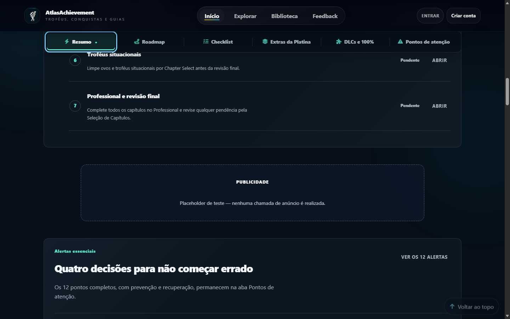
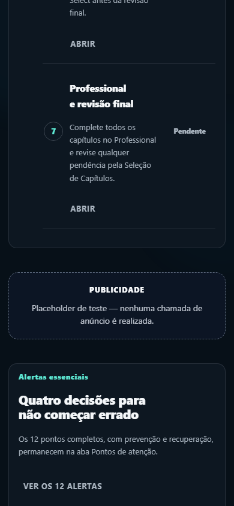

# Resident Evil 5 — Fase 8 — Preparação para produção

Data da preparação: 21/07/2026  
Página-alvo: `https://atlasachievement.com.br/jogo/resident-evil-5`  
Escopo executado: preparação técnica local antes do deploy  
Estado pós-deploy: **não executado e não simulado**  
Commit/deploy: **não realizados**  
Publicidade real: **não instalada, não carregada e não clicada**

## 1. Veredito executivo

**PREPARAÇÃO PRÉ-DEPLOY CONCLUÍDA, COM TODAS AS FLAGS DE ANALYTICS, CWV, ERROR MONITORING E PUBLICIDADE DO RE5 DESLIGADAS.**

O guia pode seguir pelo fluxo normal de revisão e deploy com as flags desligadas. A ativação de analytics/CWV do RE5 permanece condicionada a consentimento/configuração aprovados e revisão jurídica. A ativação de publicidade permanece bloqueada por, no mínimo: ausência de CMP confirmada/certificada e integração TCF 2.3; ausência de `ads.txt`; falta de confirmação do proprietário sobre a conta/linha oficial; ausência de implementação e homologação de um adaptador real de anúncios; e ausência, por definição, dos checkpoints pós-deploy.

Não há promessa de aprovação no AdSense. Essa decisão pertence exclusivamente ao Google. Nenhum resultado de Search Console, Core Web Vitals de campo, AdSense, Policy Center ou tráfego pós-deploy foi inventado.

## 2. Gate da Fase 7

O gate foi aberto porque `RELATORIO_RE5_FASE7_CERTIFICACAO.md` declara **APROVADO — 96/100** e as evidências locais sustentam os itens obrigatórios.

| Requisito | Evidência da Fase 7 | Estado |
|---|---|---|
| P0 aberto | 0 | Aprovado |
| P1 aberto | 0; três achados encontrados e corrigidos | Aprovado |
| Troféus | 71/71 únicos: 51 base + 20 DLC | Aprovado |
| Abas | seis funcionais | Aprovado |
| Paridade | seed, snapshot, banco, API, SSR e DOM auditados | Aprovado |
| Acessibilidade | nenhuma falha crítica/séria conhecida no escopo WCAG 2.2 AA auditado; Lighthouse Accessibility 100 | Aprovado |
| Performance | sem regressão relevante | Aprovado |
| Outros guias | `inside`, `resident-evil-village` e `resident-evil-6` sem regressão observada | Aprovado |

Os relatórios das Fases 1–6 e o código/testes finais foram lidos. `RELATORIO_RE5_FASE0.md` não existe no workspace; sua ausência já estava registrada na Fase 7 e nenhum conteúdo de Fase 0 foi presumido.

## 3. Inventário de produção

| Item | Estado encontrado | Decisão nesta fase |
|---|---|---|
| Google Analytics | Integração global existente, com `GA_MEASUREMENT_ID` e fallback de produção. O caminho otimizado do RE5 já removia a tag global. | O RE5 continua sem `gtag`; foi criado um contrato first-party privado, bloqueado por flag e consentimento. Nenhum tracker novo foi instalado. |
| Endpoint de eventos | `POST /api/analytics/events`, same-origin, e armazenamento interno já existentes. | O backend agora aceita e revalida o contrato fechado do RE5 apenas quando `RE5_PRODUCT_ANALYTICS_ENABLED=true`. |
| Métricas administrativas | `GET /api/analytics/admin/beta`, protegido por admin. | Acrescentada agregação `residentEvil5` de 90 dias: contagens, razões por `guide_view`, grupos fechados e p75 elegível, sem payload individual. |
| Search Console | Nenhuma propriedade, ownership token ou configuração de conta confirmável no repositório. | Nenhuma solicitação/clique foi automatizado. Checklists pós-deploy preparados. |
| AdSense | Não há script `adsbygoogle`/`googlesyndication` nem slots reais. `public/index.html` contém metadado global de conta `ca-pub-…2611`, preexistente, cuja titularidade não pôde ser confirmada. | O identificador não foi copiado para `ads.txt`, não foi tratado como credencial de autorização e não foi usado pelo módulo do RE5. Nenhum publisher ID foi inventado. |
| CMP/consentimento | Nenhuma CMP, integração IAB TCF ou versão TCF detectada. | Bloqueador de ativação. Não foi criada CMP própria. Ausência do adaptador equivale a recusa. |
| Error monitoring | Nenhum fornecedor aprovado detectado. | Criada somente a interface desacoplada `AtlasErrorMonitoring.capture`; sem adaptador, nada é enviado ou armazenado. |
| Feature flags | Havia flags gerais, mas nenhuma matriz própria de produção do RE5. | Adicionadas flags de analytics, CWV, erros, anúncios, placeholders e quatro placements. |
| Variáveis de ambiente | `.env.example` já documentava produção e GA. | Flags do RE5 documentadas com defaults seguros. |
| CSP | Permite hosts de GA globais; não permite hosts necessários a AdSense. | Preservada. Não foi ampliada enquanto anúncios estiverem desativados. |
| Privacidade | `/privacidade` existe; produção respondeu HTTP 200. | Conteúdo inventariado; revisão jurídica independente continua necessária. |
| Cookies | Não existe página separada de cookies. A privacidade contém seção sobre cookies/armazenamento. | Pendência de produto/jurídico antes da ativação publicitária, sem expansão global silenciosa. |
| Termos/Sobre/Contato | `/termos`, `/sobre` e `/contato` existem; produção respondeu HTTP 200. | Preservados. |
| `ads.txt` | Arquivo local ausente e produção `/ads.txt` respondeu HTTP 404. | Bloqueador. Nenhuma linha fictícia foi criada. |
| `robots.txt` | Produção: HTTP 200, `text/plain`. | Deve ser reconferido após deploy. |
| Sitemap | Produção: HTTP 200, XML. Teste SEO confirmou o RE5 uma vez. | Deve ser reconhecido uma vez no Search Console; não reenviar repetidamente. |
| Manifest | `public/site.webmanifest` existe. | Preservado. |
| Service worker | Nenhum service worker ativo encontrado; há apenas limpeza defensiva de registros/caches antigos. | Sem mudança. |
| HTTPS | Página e rotas institucionais responderam por HTTPS. | Reconferir no checkpoint de 24 horas. |

Auditoria HTTP pública de 21/07/2026:

| URL | HTTP | Content-Type |
|---|---:|---|
| `/jogo/resident-evil-5` | 200 | `text/html; charset=utf-8` |
| `/ads.txt` | **404** | `text/html; charset=utf-8` |
| `/robots.txt` | 200 | `text/plain; charset=utf-8` |
| `/sitemap.xml` | 200 | `application/xml; charset=utf-8` |
| `/privacidade`, `/termos`, `/sobre`, `/contato` | 200 | `text/html; charset=utf-8` |

## 4. Privacidade, consentimento e base operacional

O RE5 só transmite evento se as duas condições forem verdadeiras:

1. `RE5_PRODUCT_ANALYTICS_ENABLED=true`;
2. `AtlasConsent.hasConsent('analytics') === true`.

Adaptador ausente, exceção ou recusa resultam em zero eventos. O transporte usa `POST /api/analytics/events`, same-origin, com `credentials: 'omit'`. Checklist e preferências essenciais continuam funcionando quando analytics/publicidade são recusados.

Categorias separadas:

| Categoria | Uso | Recusa |
|---|---|---|
| Essencial | checklist local e funcionamento do guia | guia continua funcional |
| Preferências | densidade/estado visual conforme política vigente | não depende de publicidade |
| Analytics | eventos agregados e CWV | não envia nem grava marcador de retorno |
| Publicidade | futura integração autorizada | não carrega; placeholders não fazem request |

Para EEE, Reino Unido e Suíça, a documentação atual do Google exige uma CMP certificada ao servir anúncios e a integração aplicável deve ser confirmada com TCF 2.3. Nenhuma CMP foi encontrada, portanto a configuração real ainda é **ausente/não verificável**. Antes de qualquer ativação, o proprietário deve confirmar no console do fornecedor: certificação Google vigente, TCF 2.3, igualdade visual entre aceitar/recusar, gerenciamento e reabertura de preferências, comportamento de consentimento e anúncios não personalizados. Referências: [requisitos de CMP do Google](https://support.google.com/adsense/answer/13554116) e [gestão de CMP no AdSense](https://support.google.com/adsense/answer/7670013).

Testes técnicos não demonstram conformidade com LGPD, GDPR ou outra legislação. Revisão jurídica independente permanece obrigatória.

Risco global identificado, sem alteração fora do escopo: outras páginas podem carregar a integração GA preexistente em produção enquanto nenhuma CMP foi localizada. O RE5 foi mantido sem essa tag, mas o proprietário deve auditar o comportamento site-wide antes de considerar o mecanismo de consentimento resolvido.

## 5. Contrato de analytics

O contrato integral está em [`docs/RE5_ANALYTICS_EVENTS.md`](docs/RE5_ANALYTICS_EVENTS.md). São 22 eventos com nome, descrição, gatilho, propriedades permitidas/proibidas, requisito de configuração/consentimento, exemplo e teste.

| Grupo | Eventos |
|---|---|
| Navegação | `guide_view`, `guide_tab_open`, `guide_anchor_open`, `guide_internal_search`, `guide_filter_change` |
| Execução | `roadmap_start`, `roadmap_step_open`, `checklist_open`, `checklist_first_toggle`, `checklist_progress_milestone`, `next_action_open` |
| Utilidade | `instructional_visual_view`, `source_link_open`, `video_link_open`, `guide_save`, `guide_copy_link`, `report_problem_open` |
| DLC | `dlc_package_open`, `versus_route_open`, `score_stars_open`, `agitators_open` |
| Campo | `guide_web_vital` |

Dados permitidos são exclusivamente enums, buckets e números limitados: aba/grupo, origem fechada, tamanho da busca em faixa, contagem de resultados em faixa, progresso em `0%`, `1–24%`, `25–49%`, `50–74%`, `75–99%` ou `100%`, métrica/valor/rating, classe de dispositivo, conexão em bucket, versão limitada e estado do slot.

Dados rejeitados no cliente e novamente no servidor: nome, e-mail, texto da busca, texto livre, URL completa/query/hash livre, referrer completo, UA, conteúdo de comentários/formulários/localStorage, cookies, tokens, headers, ID/nome/lista de troféus, stack/mensagem de erro, fingerprint, identificador de sessão/usuário e propriedades desconhecidas.

Proteções implementadas:

- nenhum evento no SSR ou em toda renderização;
- `guide_view` e interações de marco deduplicados por carregamento;
- um clique especializado não gera simultaneamente o evento genérico;
- busca usa debounce e buckets, nunca o texto;
- scroll automático não gera visualização instrucional;
- o marcador local de retorno só existe com consentimento e nunca é transmitido como identificador;
- o servidor rejeita eventos legados no caminho/slug do RE5 e eventos RE5 em outros jogos;
- a agregação administrativa não devolve metadata individual.

As razões do funil usam `guide_view` como denominador numa janela declarada de 90 dias. Sem identificador de pessoa/sessão, elas são razões agregadas de eventos por visualização, não conversão de usuários únicos; pesquisas/filtros repetidos devem ser lidos como uso por visualização, não como percentual de pessoas.

## 6. Core Web Vitals de campo

O coletor compatível com LCP, INP, CLS, TTFB e FCP foi preparado, mas só inicializa com analytics + CWV + consentimento. Ele envia pathname fixo/normalizado e segmenta somente por mobile/desktop, conexão em bucket, aba inicial, versão do frontend e `ad_state` (`none`, `reserved`, `loaded`).

Metas p75 registradas:

- LCP ≤ 2,5 s;
- INP ≤ 200 ms;
- CLS ≤ 0,1.

Mínimo estatístico adotado por métrica/segmento: **200 amostras válidas**, janela de coleta de **pelo menos 7 dias** e presença em **pelo menos 3 dias distintos**. O backend só expõe p75 quando o segmento alcança esse mínimo. O estado atual é: **dados insuficientes — nenhuma medição pós-deploy foi simulada**. TBT de laboratório não foi apresentado como substituto de INP.

## 7. Error monitoring

Não foi instalado fornecedor. O adaptador interno aceita somente os grupos `javascript`, `unhandled_rejection`, `api`, `hydration`, `persistence`, `comments`, `asset_404`, `tab` e `filter`, com componentes enumerados. O payload contém apenas `kind`, `component`, pathname fixo e versão do frontend.

Mensagem, stack, parâmetros, tokens, cookies, headers e formulário são descartados. Há deduplicação do mesmo grupo por 60 s e limite de cinco capturas por minuto. Exceção do próprio adaptador é absorvida e não cria loop. A ligação automática aos pontos de erro deverá ser feita apenas quando houver fornecedor aprovado e revisão do modelo de dados.

## 8. Prontidão para AdSense

### Pontos favoráveis já auditados

- conteúdo original, substancial, com autoria, fontes e metodologia;
- navegação clara, seis abas e experiência mobile;
- Sobre, Contato, Privacidade e Termos publicados;
- HTTPS, robots e sitemap respondendo;
- 71/71 troféus e ausência de páginas vazias no escopo;
- links editoriais e dados estruturados auditados na Fase 7;
- Lighthouse local com acessibilidade 100 e CLS dentro da meta;
- placeholders claramente rotulados e fora de controles/checklist.

### Bloqueadores antes de publicidade real

1. integrar e homologar CMP certificada pelo Google, com TCF 2.3 onde aplicável;
2. obter a linha oficial do `ads.txt` diretamente da conta autorizada e publicar HTTP 200/texto;
3. confirmar que o metadado global de publisher pertence à conta real; não inferir titularidade pelo valor público;
4. concluir revisão jurídica de privacidade/cookies/termos e do fluxo de preferências;
5. criar e revisar um adaptador real de slots com carregamento único, consentimento, lazy load, deduplicação e CSP mínima — fora desta fase enquanto não houver autorização;
6. homologar Policy Center e Ad Experience Report após o proprietário publicar;
7. coletar dados de campo suficientes antes de avaliar impacto real.

Conclusão: **o conteúdo/layout está preparado para uma futura homologação manual, mas o site não está autorizado por este relatório a ativar AdSense**. Não há garantia de aprovação.

### `ads.txt`

- arquivo local: ausente;
- produção: HTTP 404;
- Content-Type esperado após criação: texto;
- linha da conta real: não fornecida/confirmada;
- publisher fictício: nenhum foi adicionado;
- duplicatas/vendedores não autorizados: não avaliáveis enquanto o arquivo não existir.

O proprietário deve copiar a linha exatamente como fornecida pela conta AdSense real, validar ownership e vendedores e só então publicar. O valor do metadado HTML não basta para fabricar a linha.

## 9. Posições candidatas e apresentação

Os placeholders existem apenas com `RE5_ADS_TEST_PLACEHOLDERS=true`. `RE5_ADS_ENABLED` continua falso e não existe código de anúncio real.

| Placement | Inserção | Proteção |
|---|---|---|
| Resumo | depois de `#guideQuickPlan`, bloco editorial completo | nunca antes da primeira resposta, no hero ou entre título/visão geral |
| Roadmap | depois de `#guideRoadmapPanel`, após o grupo completo | nunca entre etapas dependentes |
| Extras | depois de `#extras-upgrades-take-it-to-the-max` | nunca dentro de BSAA, tesouros ou Score Stars |
| DLC | depois de `#re5-versus-dlc` | nunca dentro da rota de boost |

Checklist recebe **zero slots**. Também são proibidos hero, navegação de abas, toolbar, filtros, label/checkbox, botão de concluir, menus, diagramas, alertas internamente e sequências curtas.

Cada placeholder:

- usa o rótulo “Publicidade” e nota explícita de modo de teste;
- tem `role="region"` e nome acessível;
- é visualmente distinto de card editorial e não tem controle focável;
- reserva 160 px desktop e 112 px mobile;
- reflowa sem overflow;
- fica `hidden` e com altura zero em `no-fill`, `blocked` ou `error`;
- não usa “Recomendado”, “Veja também”, incentivo ou imitação editorial.

### Screenshots revisados

Desktop 1440 × 900:



Mobile 390 × 844:



## 10. Performance: sem slots × placeholders

Lighthouse 13.4.1 em laboratório, três execuções por modo e perfil; tabela com medianas. Evidência integral em [`performance-comparison.json`](artifacts/re5-phase8/performance-comparison.json) e [`lighthouse/`](artifacts/re5-phase8/lighthouse/).

| Modo/perfil | Perf. | A11y | BP | SEO | LCP | CLS | TBT | Requests | Transferência |
|---|---:|---:|---:|---:|---:|---:|---:|---:|---:|
| Sem slots — mobile | 99 | 100 | 100 | 100 | 1.917 ms | 0 | 0 ms | 11 | 476.384 B |
| Placeholders — mobile | 99 | 100 | 100 | 100 | 1.898 ms | 0 | 13 ms | 11 | 476.486 B |
| Sem slots — desktop | 100 | 100 | 100 | 100 | 679 ms | 0,00046 | 0 ms | 11 | 476.372 B |
| Placeholders — desktop | 100 | 100 | 100 | 100 | 680 ms | 0,00046 | 0 ms | 11 | 476.489 B |

Delta dos placeholders: performance 0 ponto em ambos; LCP −20 ms mobile e +0,3 ms desktop; CLS 0; TBT +13 ms mobile e 0 desktop; requests 0; transferência +102 B mobile e +117 B desktop. As 12 execuções tiveram Accessibility 100, nenhuma falha auditada de acessibilidade e nenhuma request para GA/AdSense. Esses números são de laboratório e não representam tráfego real.

## 11. Testes de falha e jornadas

Evidência: [`production-qa.json`](artifacts/re5-phase8/production-qa.json).

| Cenário | Resultado |
|---|---|
| Flags desligadas | 0 slots, 0 eventos, 0 tags/requests GA/AdSense |
| Consentimento ausente | 0 eventos; guia e placeholders de teste funcionais |
| Consentimento recusado | 0 eventos; 51 troféus e seis abas funcionais |
| Consentimento concedido em mock | contrato emitido; zero PII/texto/ID de troféu; nenhuma tag externa |
| Evento duplicado/hidratação | `guide_view` único após reinicializações |
| Mesmo clique | ações especializadas emitiram um evento |
| Busca | texto sentinela não apareceu no payload; apenas buckets |
| Checklist | primeiro toggle não expôs ID/nome/lista; 51 troféus preservados |
| Filtro | mudança de densidade emitiu um evento fechado e preservou 51 troféus |
| Teclado | `ArrowRight` moveu foco/seleção de Resumo para Roadmap; painel correto visível |
| Screen reader/a11y | slots nomeados, zero focáveis, Lighthouse Accessibility 100 |
| Tag/módulo bloqueado | conteúdo, seis abas, 51 troféus e interação de abas preservados; 0 slots |
| Ad blocker/domínios bloqueados | nenhuma dependência externa; guia íntegro |
| No-fill | altura de 112 px para 0, slot oculto, checklist preservado |
| Rede 3G degradada | carregamento em ~5,0 s no ensaio, 51 troféus, quatro placeholders, sem overflow/request externa |
| Error monitoring | redaction, agrupamento e rate limit aprovados; mensagem/token não enviados |
| Outros jogos | `inside`, `resident-evil-village`, `resident-evil-6`: sem script/config/slot do RE5 e sem overflow |

Nenhuma tag real foi disparada, nenhum anúncio real foi renderizado e nenhum clique publicitário foi realizado.

## 12. Feature flags e operação

Defaults documentados em `.env.example`:

```dotenv
RE5_PRODUCT_ANALYTICS_ENABLED=false
RE5_CWV_ENABLED=false
RE5_ERROR_MONITORING_ENABLED=false
RE5_ADS_ENABLED=false
RE5_ADS_TEST_PLACEHOLDERS=false
RE5_ADS_PLACEMENT_SUMMARY_ENABLED=true
RE5_ADS_PLACEMENT_ROADMAP_ENABLED=true
RE5_ADS_PLACEMENT_EXTRAS_ENABLED=true
RE5_ADS_PLACEMENT_DLC_ENABLED=true
```

As quatro flags de placement apenas definem candidatos; o master de anúncios e o modo placeholder permanecem desligados. Como a configuração é lida no processo, a infraestrutura atual permite desligamento por variável e restart/redeploy operacional, não alteração dinâmica sem reiniciar. Não se deve afirmar “sem novo deploy” se a plataforma não propagar env/restart automaticamente.

Ordem autorizável no futuro, após resolução dos bloqueadores:

1. deploy com todas as flags falsas;
2. validar produção e consentimento/CMP;
3. ativar analytics do RE5 em amostra controlada, mantendo CWV/erros/anúncios separados;
4. ativar CWV somente depois de validar payloads e consentimento;
5. homologar placeholders, nunca uma tag real, em ambiente de teste;
6. implementar/revisar adaptador real apenas com conta e CMP aprovadas;
7. ativar um placement por vez e observar antes do próximo.

Auto Ads não foi habilitado nem recomendado para rollout inicial.

## 13. Plano pós-deploy — executar somente após publicação pelo proprietário

### Checkpoint de 24 horas

- [ ] confirmar HTTP 200 da canonical pública e HTTPS sem erro;
- [ ] comparar canonical, title, robots e schemas com a revisão publicada;
- [ ] testar API, seis abas, checklist, filtros, anchors, comentários e assets;
- [ ] revisar logs e erros agrupados, sem PII;
- [ ] observar CLS visual em mobile/desktop e conteúdo sem sobreposição;
- [ ] validar que todas as flags continuam no estado planejado;
- [ ] confirmar zero chamada AdSense enquanto `RE5_ADS_ENABLED=false`;
- [ ] inspecionar a URL no Search Console e testar a URL publicada;
- [ ] solicitar indexação uma vez, quando apropriado; não automatizar/repetir;
- [ ] conferir canonical escolhida, status indexável, sitemap, robots, dados estruturados e HTTPS;
- [ ] revisar Ações manuais, Problemas de segurança e Policy Center;
- [ ] registrar resultados reais, sem retroagir para este relatório.

### Checkpoint de 7 dias

- [ ] agrupar erros e comparar volumes, componentes e versões;
- [ ] verificar eventos duplicados e distribuição por contrato;
- [ ] revisar início de roadmap/checklist, primeira interação e progresso sem perfil individual;
- [ ] verificar busca/filtros somente em buckets;
- [ ] conferir Search Console: cobertura/indexação, canonical, sitemap reconhecido e rich results;
- [ ] revisar avisos de consentimento, recusa e reabertura de preferências;
- [ ] verificar cobertura de `ads.txt` apenas se a linha oficial tiver sido publicada;
- [ ] revisar Policy Center e Ad Experience Report;
- [ ] manter CWV como “dados insuficientes” abaixo do mínimo.

### Checkpoint de 28 dias

- [ ] calcular p75 de LCP/INP/CLS somente para segmentos com 200+ amostras, 7+ dias e 3+ dias distintos;
- [ ] comparar mobile/desktop e `ad_state` sem misturar segmentos para melhorar resultado;
- [ ] revisar funil agregado, retorno, uso de abas, busca, filtros, DLCs, visuais, fontes e reports;
- [ ] avaliar impacto publicitário apenas se houve ativação autorizada; comparar com baseline sem anúncios;
- [ ] revisar indexação, canonical escolhida, consultas/páginas do Search Console e mudanças reais de cobertura;
- [ ] conferir erros, consentimento, Policy Center, Ad Experience Report e segurança;
- [ ] documentar amostra/limitações e não concluir estatisticamente com tráfego insuficiente.

Nenhum item dos checkpoints acima foi marcado como executado nesta fase.

## 14. Critérios de rollback

Desligar primeiro `RE5_ADS_ENABLED`; desligar o placement específico quando o problema for localizado. Desligar analytics/CWV/error monitoring somente quando o incidente estiver nesses componentes. O guia e o checklist não dependem dessas flags.

Rollback/desligamento imediato quando houver:

- perda/bloqueio de conteúdo, checklist ou abas quebrados;
- P0/P1, aumento expressivo de erros ou falha de API/hidratação persistente;
- erro de consentimento, tag antes do sinal, dark pattern ou impossibilidade de reabrir preferências;
- aviso relevante no Policy Center;
- anúncio confundido com controle/editorial ou indício de clique acidental;
- conteúdo coberto, foco bloqueado ou mobile sobreposto;
- CLS consistentemente acima de 0,1;
- regressão grave de LCP/INP no campo com amostra suficiente;
- falha publicitária derrubando ou atrasando conteúdo;
- vendedor/linha `ads.txt` incorreto ou conta não confirmada.

Após desligar: validar que não há requests/slots, preservar evidências, registrar versão/horário/segmento e repetir as jornadas críticas. Nenhum desligamento publicitário deve desativar o conteúdo ou checklist.

## 15. Testes finais

| Comando/auditoria | Resultado |
|---|---|
| `node scripts/test-re5-phase8-events.js` | Passou: 22 eventos, flags off, payloads sem PII |
| `node scripts/qa-re5-phase8.js` | Passou: consentimento, flags, placeholders, bloqueios, no-fill, rede lenta, teclado, filtro, a11y e regressões |
| `node scripts/run-re5-phase8-lighthouse.js` | 12 relatórios concluídos |
| `node scripts/summarize-re5-phase8-lighthouse.js` | Passou: comparação sem requests proibidas e sem regressão dos slots |
| `npm run test:guide -- resident-evil-5` | Passou |
| `npm run test:seo` | Passou: 12 guias indexáveis + noindex + rotas isoladas + sitemap |
| `npm run build` | Passou; ambiente local em Node 24.14.1 emitiu aviso porque o projeto recomenda Node 20.x |
| Auditoria `/ads.txt` | Falhou como prontidão externa: local ausente e produção HTTP 404; nenhum arquivo fictício criado |
| `npm test` adicional | Não concluiu: após corrigir uma asserção obsoleta de cache-buster, encontrou falha preexistente/geral do catálogo no grupo “Duração”, fora do RE5 e não mascarada por esta fase |
| `git diff --check` | Passou; somente avisos informativos de conversão LF→CRLF do Git no Windows |

O teste obrigatório do guia e o build passaram. A falha adicional do catálogo deve ser tratada em seu próprio escopo antes de um release global; nenhum código de outro jogo foi alterado para contorná-la.

## 16. Arquivos da Fase 8

- `.env.example` — flags e defaults seguros;
- `src/config/env.js` — leitura das flags;
- `src/app.js` — config isolada e módulo local do RE5, sem GA no caminho;
- `public/js/re5-production.js` — contrato, consent gate, eventos, CWV, adaptador de erros e placeholders;
- `public/css/re5-phase6.css` — apresentação reservada/segura dos placeholders;
- `src/services/analytics.service.js` — validação server-side e agregação privada;
- `docs/RE5_ANALYTICS_EVENTS.md` — contrato integral;
- `scripts/test-re5-phase8-events.js` — contrato/privacidade/flags/agregação;
- `scripts/qa-re5-phase8.js` — matriz no navegador e screenshots;
- `scripts/run-re5-phase8-lighthouse.js` — 12 execuções controladas;
- `scripts/summarize-re5-phase8-lighthouse.js` — comparação e gates;
- `scripts/test-layers.js` — expectativa do segundo módulo local do RE5;
- `scripts/regression-smoke.js` — validação genérica de cache-buster em vez de valor histórico fixo;
- `artifacts/re5-phase8/` — QA, screenshots, comparação e relatórios Lighthouse;
- `RELATORIO_RE5_FASE8_PRODUCAO.md` — este relatório.

O workspace já continha alterações de fases anteriores e elas foram preservadas. Não houve alteração intencional de conteúdo/dados de outros jogos.

## 17. Pendências externas e decisão final

| Pendência | Responsável/condição | Bloqueia |
|---|---|---|
| Confirmar propriedade Search Console e acesso | proprietário | monitoramento/indexação manual |
| Selecionar/configurar CMP Google-certified e confirmar TCF 2.3 | proprietário + jurídico/privacidade | analytics/ads onde consentimento é exigido; ads em EEE/UK/CH |
| Revisão jurídica independente | jurídico | afirmações de conformidade e ativação responsável |
| Confirmar conta/publisher AdSense real | proprietário | anúncios e `ads.txt` |
| Obter/publicar linha oficial `ads.txt` | proprietário | prontidão AdSense |
| Implementar adaptador real de anúncios com revisão específica | engenharia, após autorização | anúncios reais |
| Amostra de CWV de campo | tráfego real pós-deploy | decisão de performance de campo |
| Checkpoints 24 h/7 d/28 d | proprietário/equipe após deploy | conclusão operacional da Fase 8 |
| Falha geral do `npm test` no catálogo “Duração” | equipe do catálogo | release global verde |

**Confirmação final:** `RE5_PRODUCT_ANALYTICS_ENABLED=false`, `RE5_CWV_ENABLED=false`, `RE5_ERROR_MONITORING_ENABLED=false`, `RE5_ADS_ENABLED=false` e `RE5_ADS_TEST_PLACEHOLDERS=false` são os defaults entregues. Não houve commit, deploy, CMP própria, tracker externo, anúncio real, Auto Ads ou clique em anúncio.
